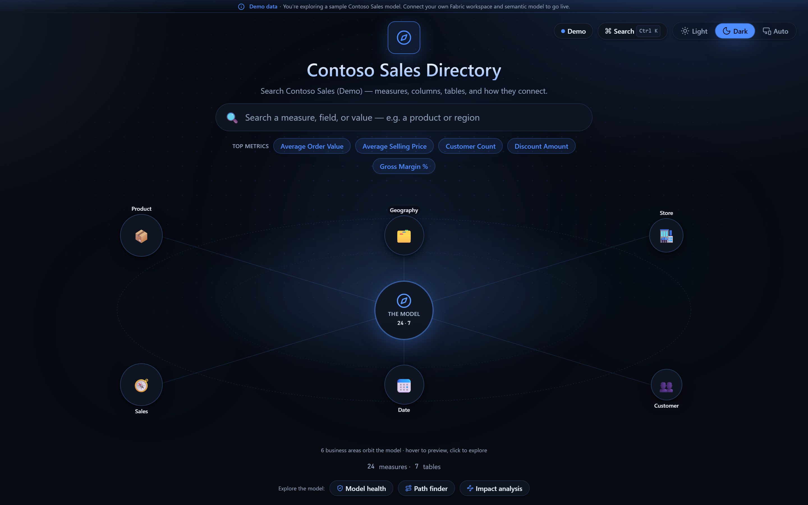
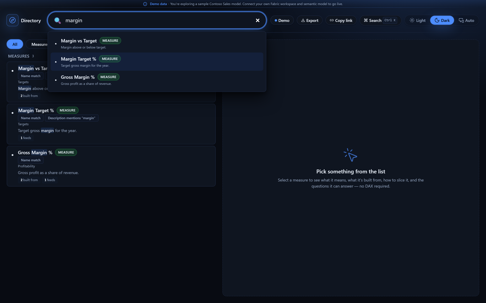
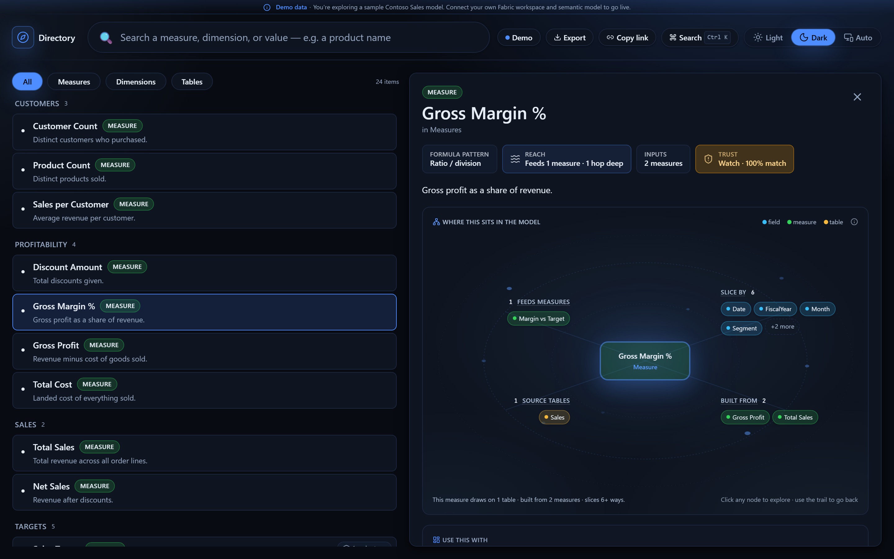
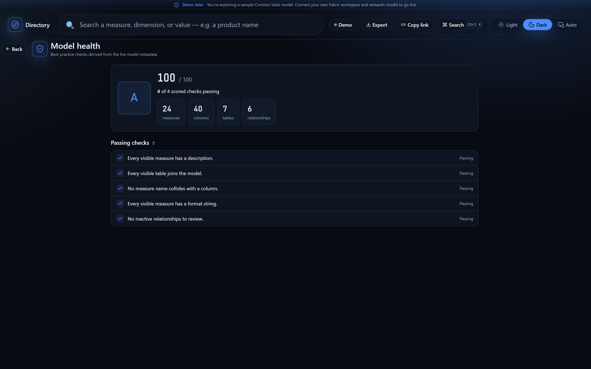
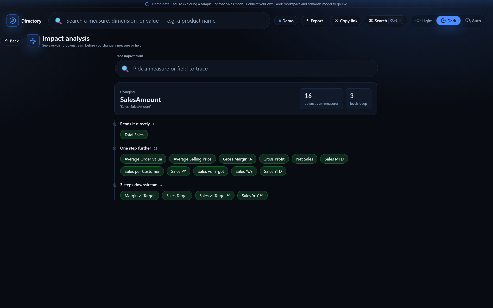
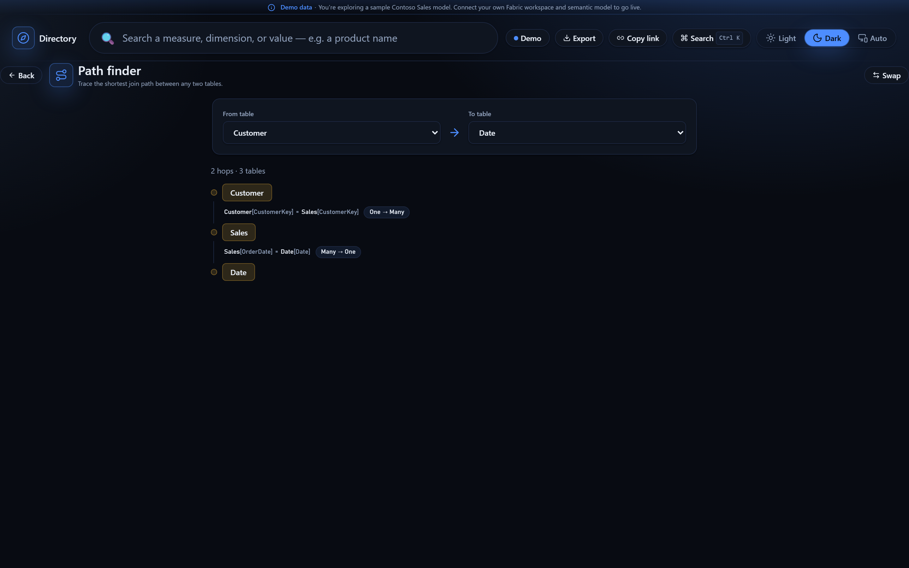

# Semantic Directory

A living, explainable **directory for any Power BI / Fabric semantic model**. Point it at
your Fabric workspace and semantic model and it builds a searchable map of the model —
measures, columns, tables, and how they connect — straight from the model's own metadata
and DAX. **Deterministic by design — every insight is computed from the model's own
metadata and DAX, never generated.** Every insight traces back to the model itself.

Built as a **Microsoft Fabric Data App** on the [Rayfin](https://github.com/microsoft/awesome-rayfin)
framework, and made to be re-used: plug in *your* model, or explore the bundled **Contoso
Sales** demo with zero setup.

---

## Screenshots

> Dark mode, running against the bundled **Contoso Sales** demo model — zero configuration.



| Search that answers | Measure DNA (DAX-parsed lineage) |
| :--- | :--- |
|  |  |

| Model health | Impact analysis | Path finder |
| :--- | :--- | :--- |
|  |  |  |

---

## What it does

- **Search that answers, not dead-ends.** Type a value like *"Total Sales"* or a member
  like a product name and the directory surfaces the measure, the column it lives in, the
  matching members, and the metrics that can slice by it — not just a field name.
- **Measure DNA.** For any measure: a plain reading of its DAX and exactly what it's built
  from (child measures → columns → tables), derived by parsing the model's own expressions.
- **Measure families.** Related measures auto-collapse into lead families so a long measure
  list becomes a handful of understandable groups.
- **Relationships & lineage.** See how tables relate and how a number flows from source
  columns up to the measure that reports it.
- **Entity constellation.** An interactive, light/dark-themed map of how any entity connects
  to the rest of the model.
- **Auto-derived browse areas.** Business areas are inferred from the model's dimension
  tables — no curation required, works for any model.

## Demo mode + live mode

The app is **never blank** and needs no configuration to try.

- **Demo mode (default).** With no model configured, the app boots straight into a bundled
  **Contoso Sales** sample model — full search, measure DNA, families, relationships, and
  constellation — so you can see everything it does before connecting anything. A banner
  makes clear you're on demo data.
- **Live mode.** The moment you wire a real workspace + semantic model into `fabric.yaml`,
  the app introspects **that** model live (its measures, tables, columns, relationships,
  and member values) and swaps it in as the source of truth. If the live model is briefly
  unreachable, the demo bundle stands in as a graceful fallback.

```
Fabric semantic model ──(live metadata + DAX)──▶ full catalog ──▶ UI
        (no model configured) ──▶ bundled Contoso demo ──▶ UI
```

## Tech stack

| Layer       | Choice                                                            |
| ----------- | ---------------------------------------------------------------- |
| UI          | React 19, TypeScript (strict), Vite (rolldown-vite)              |
| Styling     | Tailwind CSS v4, CSS custom-property theme tokens (light + dark) |
| Motion      | framer-motion (reduced-motion aware)                             |
| Search      | minisearch (client-side, deterministic)                         |
| Data / auth | `@microsoft/rayfin-*`, `@microsoft/fabric-app-data*`            |
| Testing     | Vitest + Testing Library + jsdom                                 |
| Deploy      | Rayfin CLI → Microsoft Fabric (static hosting, `*.fabricapps.net`) |

---

## Getting started

### Prerequisites

- **Node.js 20.19+ or 22.12+** (`node -v`) — Vite 8's minimum; 22 LTS recommended.
- That's it for the demo. The **Rayfin** and **Fabric** CLIs ship as dev
  dependencies, so `npx rayfin …` and `npx fabric-app-data …` work right after
  `npm install` — no global installs, no Azure CLI required.

### Install

```bash
npm install
```

### Run the demo (no setup)

```bash
npm run dev
```

Open the dev URL. With no model configured you'll land in the **Contoso Sales demo** — try
the search, open a measure to see its DNA, and explore the constellation. This is the full
experience running entirely on the bundled sample.

### Go live — connect your model & deploy

Live mode needs two things wired up: **(A)** which semantic model the directory
reads, and **(B)** a Rayfin backend + Fabric sign-in so the app can run live DAX.
The CLIs do both — you don't hand-edit env files.

**1. Bind your semantic model.** Copy your semantic model's URL from the Fabric
portal and let the CLI extract the IDs into `fabric.yaml` (keep the alias `model`
— it's the connection name the app queries):

```bash
npx fabric-app-data add semanticModel model --from-url "<your semantic model's Fabric URL>"
```

> Prefer to do it by hand? Edit `fabric.yaml` and replace the placeholder GUIDs
> under the `model` alias with your `workspaceId` and semantic-model `itemId`.
> If you rename the alias, also rename `CONNECTION` in
> `src/queries/metadata/index.ts`.

**2. Sign in to Fabric** (Entra ID; opens the MSAL account picker):

```bash
npx rayfin login
```

**3. Deploy into your Fabric workspace.** Paste your **workspace** URL (the
`…/groups/<id>/list` page). This regenerates the Fabric types, builds
(`npm run build:fabric`), deploys the app as a Rayfin item, hosts it at
`https://<app>.<region>.fabricapps.net`, and provisions the backend env the app
reads:

```bash
npx rayfin up --workspace-uri "<your Fabric workspace URL>"
```

**4. Verify the deployment** and copy the hosting URL it printed
(`https://<app>.<region>.fabricapps.net`):

```bash
npx rayfin up status
```

**5. Allow the app's hosting URL (first deploy only).** The live auth handoff
only completes for redirect URIs the backend trusts, and a fresh deploy seeds
just the localhost dev URLs. Before you open the app live, add your hosting URL
and redeploy:

1. Add `https://<app>.<region>.fabricapps.net` under
   `services.auth.allowedRedirectUris` in `rayfin/rayfin.yml`.
2. Redeploy so the auth config takes effect:
   `npx rayfin up --workspace-uri "<your Fabric workspace URL>"`.

**6. Open the app from the Fabric portal.** Live authentication is brokered
through the **embedded Fabric iframe**, so your model is introspected live only
when the app runs *inside* Fabric. Open it from your workspace item list, not
from a bare URL. Model metadata (measures, columns, tables, relationships) is
read with `INFO.VIEW.*`, unaffected by row-level security; dimension **member
values** are a best-effort overlay that skips RLS-protected or very
high-cardinality columns without breaking search.

> **Local dev vs. a connected app.** Before you configure Rayfin (a fresh clone),
> `npm run dev` simply runs the **demo bundle** — perfect for local UI work. Once
> the app is connected to a real model and deployed, opening it *outside* the
> Fabric portal shows a "can't open this app outside Fabric" notice rather than
> the demo, because a model-connected app requires the Fabric auth handoff.

### Redeploy after changes

```bash
npx rayfin up --workspace-uri "<your Fabric workspace URL>"   # rebuild + redeploy
```

---

## Project structure

```
fabric.yaml               Fabric connection config (the `model` alias the app queries)
index.html                Vite entry HTML
src/
  app.config.ts           Single source of truth for app name, tagline, and demo copy
  main.tsx                App entry (boots demo directly, or the Fabric auth gate if configured)
  App.tsx                 Shell
  pages/                  Top-level pages (catalog-page)
  components/
    catalog/              Feature UI: constellation, detail views, search, cards, demo banner
    ui/                   Shared primitives (buttons, badges, panels, motion)
  catalog/                Deterministic model "brain" (no React):
    data/                 Bundled demo dataset + loader
    model/                DAX parser, dependency graph, families, structure derivation
    lineage/              Measure → column → table lineage
    browse/               Auto-derived browse-by-area (theme registry)
    search/               Value matching, slice-by resolution
  hooks/                  React data hooks (demo/live catalog, typeahead, members)
  queries/                DAX metadata queries (INFO.VIEW.*) + connection alias
  services/               Auth wiring (Fabric embedded auth, demo bypass)
  lib/                    Utilities (model-config detection, fabric client)
scripts/
  build-demo-data.mjs     Regenerates the Contoso demo dataset (npm run build:demo)
```

## Scripts

| Script | What it does |
| --- | --- |
| `npm run dev` | Start the Vite dev server. Runs the demo bundle locally; a model-connected app is introspected live only when embedded in the Fabric portal |
| `npm run build` | Generate Fabric types, run `tsc -b` typecheck, and build for production |
| `npm run build:demo` | Regenerate the bundled Contoso demo dataset (`src/catalog/data/catalog.dataset.json`) |
| `npm test` | Run the Vitest suite |
| `npm run lint` | Run ESLint |
| `npm run preview` | Preview the production build locally |

## Quality gates

```bash
npx tsc -b        # typecheck (fails on type errors)
npx eslint .      # lint
npm test          # vitest
npm run build     # production build
```

---

## Customizing

- **Branding & copy** live in `src/app.config.ts` (app name, tagline, search label, demo
  banner text) — change them in one place.
- **Demo dataset** is generated deterministically by `scripts/build-demo-data.mjs`; edit it
  and run `npm run build:demo` to ship a different sample model.
- **Browse areas** are auto-derived from your model's dimension tables — no config needed.

## License

MIT — see [LICENSE](LICENSE).
